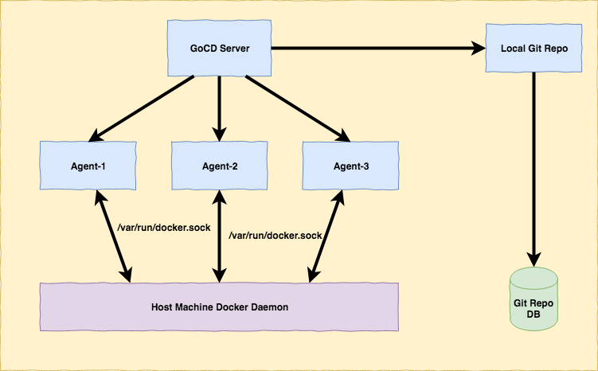
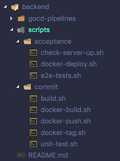
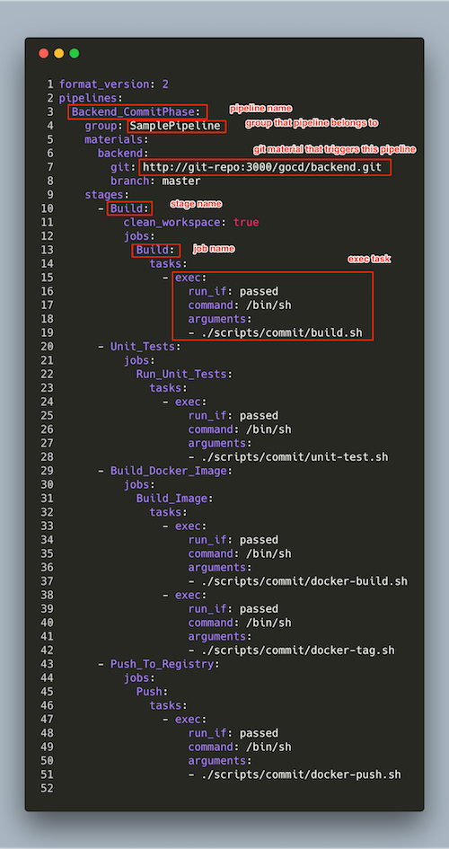
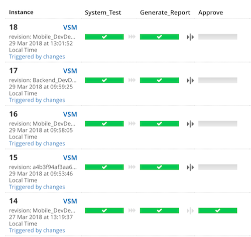
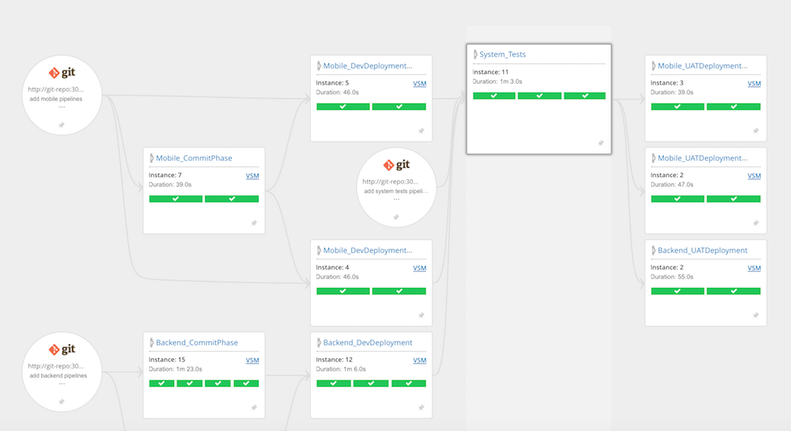

# Background

As a software developer at ThoughtWorks, I had always wanted to try out GoCD (an open source Continuous Integration and Continuous Delivery system originally developed by ThoughtWorks) but couldn't find a chance until early of this week. My client team is currently using Bamboo from Atlassian as their CI server. Having played with Bamboo for the past one year at the client side, I feel the tool can do the job, but sometimes quite limited (.e.g. in integration among multiple build plans, modelling complicated value stream). My senior suggested me to give the client a Lunch & Learn session on GoCD and how powerful it is compared to Bamboo, and so I spent one whole afternoon setting up a sample pipeline (as code) for the demonstration. I'll go through my setup in this post.

# Local GoCD Setup

First, I created a docker-compose file ([https://github.com/hpcsc/gocd](https://github.com/hpcsc/gocd)) to easily spin up a GoCD server, 3 agents, 1 local Git repository (Gogs) for demonstration purpose.



3 agents are created from GoCD `gocd-agent-docker-dind` image so docker is available within the agents

Before we proceed, we need to clarify a common term that can have different meaning in GoCD, compared to other tools: pipeline. I'll just shamelessly borrow the explaination from [GoCD Getting Started Guide](https://www.gocd.org/getting-started/part-3/):

> The Value Stream Map is the full end-to-end (from commits to production) view across pipelines, and maps to the concept of a "Continuous Delivery Pipeline" or "Deployment Pipeline", in the book, "Continuous Delivery" by Jez Humble and David Farley.

and

> There are some unfortunate differences in naming between GoCD and the book. What is termed as a "Stage of a Deployment Pipeline" in the book is called a "Pipeline" in GoCD. The "Deployment Pipeline" (end-to-end) is called the "Value Stream Map"

To follow GoCD terminology, I'll call the whole end-to-end flow is Value Stream Map, which contain multiple GoCD pipelines.

# Sample Pipelines

## Setup in Local

If you want to try out the following sample pipelines in your local machine, follow these steps:

- Clone and setup GoCD (and Gogs) in your local machine using following repo: [https://github.com/hpcsc/gocd](https://github.com/hpcsc/gocd)
- Go to [http://localhost:3000](http://localhost:3000) (Gogs server), click Register and create a Gogs user with following credentials:

```
Username: gogs
Password: password.123
```
- Make sure your local machine have following tools installed:
    - `jq`
    - `curl`
    - default public key at `~/.ssh/id_rsa.pub`

- Clone sample pipelines repository: [https://github.com/hpcsc/sample-pipeline](https://github.com/hpcsc/sample-pipeline) and run script `./scripts/setup.sh`. This script will setup necessary repositories in local Gogs server and create config repositories in GoCD
- Go to GoCD at [http://localhost:8153](http://localhost:8153), go to Agents tab and enable all 3 agents

## Structure

Below is overview of the Value Stream Map that I created for demonstration. This Value Stream Map is designed to be as close as possible to the current build pipeline used at my client.


It contains 3 Git materials:

- [https://github.com/hpcsc/sample-pipeline-backend](https://github.com/hpcsc/sample-pipeline-backend): backend build scripts and pipeline code
- [https://github.com/hpcsc/sample-pipeline-mobile](https://github.com/hpcsc/sample-pipeline-mobile): mobile build scripts and pipeline code
- [https://github.com/hpcsc/sample-pipeline-system-tests](https://github.com/hpcsc/sample-pipeline-system-tests): system tests build scripts and pipeline code

Each repository has similar structure:



- `gocd-pipelines`: GoCD pipeline as code (to be explained later)
- `scripts`: build scripts, to be invoked by tasks in GoCD pipelines. These build scripts are organized into `commit` and `acceptance` stages as in `Continuous Delivery` book. Each script does nothing but just `echo` some message and `sleep` for several seconds, .e.g. this is `build.sh`

    ``` shell
    #!/bin/sh

    echo "=========== Building Backend: Start =============="

    sleep 5

    echo "=========== Building Backend: Done  =============="
    ```

The value stream map is triggered by a commit to either backend repository or mobile repository. The commit will trigger corresponding commit pipeline (`MobileCommitPhase` or `BackendCommitPhase`). These pipelines contain 2 stages: `Build` -> `Unit_Tests` (which containing jobs and tasks that trigger corresponding scripts mentioned above)

Once the commit phase is done, deployment to dev environment is triggered. For mobile, this means 2 pipelines are run in parallel (`MobileDevDeploymentAndroid` and `MobileDevDeploymentIOS`)

When all dev deployments are done, `SystemTests` pipeline is triggered. In a real world pipeline, this will pull system tests tool and scripts from `system-tests` repo, start backend, start mobile and run system tests against mobile which in turn hit backend server. The last stage of this pipeline is `Approve` stage, which can only be triggered manually. This is to simulate a real scenario where the decision to deploy to UAT is decided by some business user.


Once pipeline is approved, it will run 3 pipelines in parallel: `MobileUATDeploymentAndroid`, `MobileUATDeploymentIOS` and `MobileUATDeploymentBackend`. Note that these pipelines use the same scripts as in Dev deployment pipelines, only differ by parameters passing to the scripts.

My sample value stream map stops here, but in real scenario, it can continue further to other environments if needed

Now I'm going to go through how pipeline as code is setup in GoCD. This is one of the features that I find quite attractive in GoCD. In other tools, pipeline as code is normally defined by a programming language/DSL, .e.g. Bamboo uses JVM languages like Java/Scala to define pipeline, TeamCity uses Kotlin. In GoCD, you can define pipeline as code in XML/JSON/YAML (or other format with additional plugins). These formats are declarative in nature, and are much easier for people to get started up, easy to read, require no complicated development environment (IDE, SDK) and therefore are ideal to setup pipeline as code. There might be a situation where XML/JSON/YAML cannot satisfy the requirements and you will need to use a general programming language to define pipelines, but those cases are rarer.

In this sample, I'm going to define the backend commit pipeline using YAML:



I have highlighted in the screenshot the relevant places where pipeline, stage, job, and task are defined. It should be straightforward to read the remaining definition of the pipeline.

These pipelines are defined in files with extension `.gocd.yaml`. The last part is to let GoCD know which repository the pipelines come from. This is done in GoCD `Config XML` menu:

```xml
<config-repos>
    <config-repo pluginId="yaml.config.plugin" id="backend-config-repo">
        <git url="http://git-repo:3000/gocd/backend.git" />
    </config-repo>
    <config-repo pluginId="yaml.config.plugin" id="mobile-config-repo">
        <git url="http://git-repo:3000/gocd/mobile.git" />
    </config-repo>
    <config-repo pluginId="yaml.config.plugin" id="system-tests-config-repo">
        <git url="http://git-repo:3000/gocd/system-tests.git" />
    </config-repo>
</config-repos>
```

GoCD YAML plugin will watch these repositories and find all files with `.gocd.yaml` extension for pipeline definition.

# Final Thoughts

That's all for the technical part. After playing with GoCD for a while, I find GoCD quite pleasant to use. Its UI and interaction flow are carefully considered to maximize user experience. One example of that is when clicking in a pipeline, I'm presented with a history of that pipeline instances, with stages that it contains and ability to rerun any stage in a single click:



For me, this is a big plus compared to Bamboo, where you need to click into individual build to see which stage fails, and you can only re-run failed stage or re-run the whole build, not re-run any stage like GoCD.

Another nice feature of GoCD is Value Stream Map, which is the full end-to-end view across pipelines. It allows you to quickly see upstream dependencies, downstream pipelines for a pipeline instance.



In summary, GoCD is a powerful tool with rich feature set built in that allows you to easily model any complicated pipeline. I highly recommend it for projects of any size.
