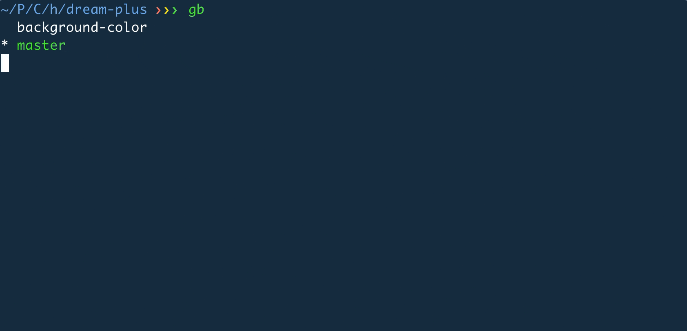
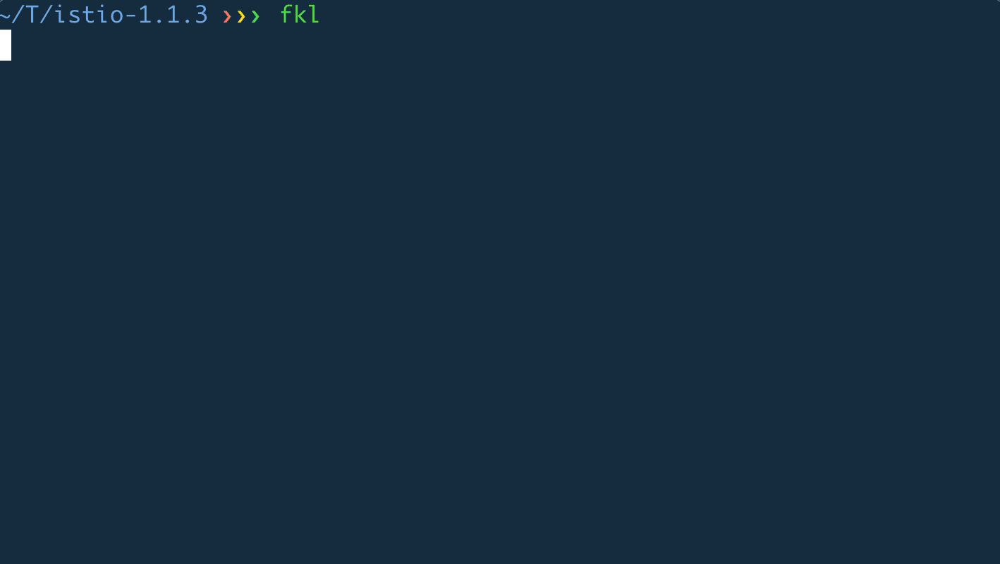

As a developer, I spend a lot of time on command line and since I found [fzf](https://github.com/junegunn/fzf), a command line fuzzy finder, I find my productivity has been improved tremendously by applying fzf in everday commands that I use. Below is the collection of small fzf snippets that I wrote and use a lot myself.

## fnpm: Run npm script

### Usage


### Source

``` shell
cat package.json | \
  jq -r '.scripts | keys[]' | \
  fzf --height 30% --reverse -1 -0 -d ',' --with-nth=1 --header 'Select npm script to run' | \
  xargs npm run
```

This script looks into current folder `package.json`, extract all the npm script names using `jq` and pipe those names to fzf for interactive selection. The selected script name will be run using `npm run`.

## fsb: Switch git branch

### Usage



### Source

``` shell
local pattern=$@
local branches branch
branches=$(git branch --all | awk 'tolower($0) ~ /'$pattern'/') &&
branch=$(echo "$branches" |
         fzf-tmux --height 30% --reverse -1 -0 +m) &&
if [ "$branch" = "" ]; then
  echo "[$0] No branch matches the provided pattern"; return;
fi;
git checkout $(echo "$branch" | sed "s/.* //" | sed "s#remotes/[^/]*/##")
```

This script takes in an optional pattern to search available git branches. If a branch matches the pattern, it will checkout that branch. There's an additional handling for case where the branch only exists in remote but not yet checked out to local. In that case this script will checkout that remote branch to a local branch.

## zf: Switch directory

### Usage


### Source

``` shell
local dir
dir="$(fasd -Rdl "$1" | fzf -1 -0 --reverse --height 30% --no-sort +m)" && cd "${dir}" || return 1
```

This script makes use of (fasd)[https://github.com/clvv/fasd] to interactively switch to a commonly-accessed directory. `fasd` itself already provides `fasd -sid` command (or `sd` if you use its default aliases), however I find it a little bit easier to use `fzf` to select, instead of typing sequence number provided by `sd`.

## Android emulator - related

### droidsa: Start Android Emulator

``` shell
alias droidsa='avdmanager list avd | sed -n -e "s/Name: //p" | tr -d " " | fzf | xargs emulator -avd'
```

This alias uses `avdmanager` to list available `avd` and starts android emulator with that `avd`

### droidrm: Uninstall a program in the current emulator/device

``` shell
alias droidrm='adb shell "pm list packages -3" | sed -e "s/.*://" |  fzf | xargs adb uninstall'
```

This alias lists user installed programs in the current emulator/device to uninstall

## Kubernetes - related

### fkrm: Delete Kubernetes resource in current namespace

#### Usage


#### Source

``` shell
local resource_type=$1
local resource_pattern=$2

if [ "$resource_type" = "" ]; then
  echo "=== resource type (.e.g. pod, service) is required"
  return
fi;

local selected=$(kubectl get $resource_type --no-headers | awk '{print $1}' | fzf-tmux --height 30% --reverse -0 --header="Choose resource to delete" --query="$resource_pattern")
if [ "$selected" = "" ]; then
  return
fi;

kubectl delete $resource_type $selected
```

The script takes in resource type (pod, deployment, service, etc) as 1st parameter and interactly select the resource to delete using fzf

### fkl: Get log of a container in current namespace

#### Usage



### Source

``` shell
local pod_pattern=$1

local pod=$(kubectl get pod --no-headers | awk '{ print $1 }' | fzf-tmux --height 30% --reverse -0 -1 --header "Select pod" --query="$pod_pattern")
if [ "$pod" = "" ]; then
  return
fi;

local container=$(kubectl get pod $pod -o json | jq -r '.spec.containers[].name' | fzf-tmux --height 30% --reverse -0 --header "Select container in pod $pod")
if [ "$container" = "" ]; then
  return
fi;

kubectl logs $pod -c $container
```

This script asks to select the pod which contains the container to get logs first. If the pod only has one container, it straight away gives the logs of that container (`-0` option for parameter), otherwise it asks again for the container to retrieve logs.
